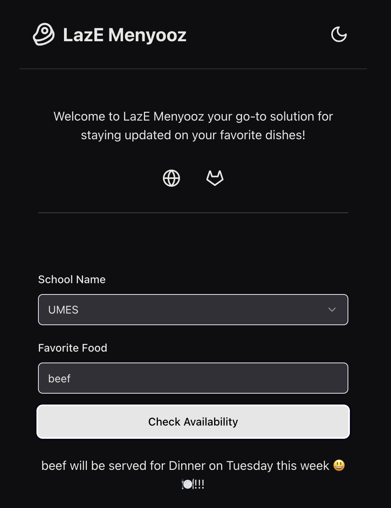

# LazE Menyooz the University Dining Dish Tracker

Welcome to LazE Menyooz the University Dining Dish Tracker! This project began as a personal quest to satisfy my craving for Barbecue Beef Briskets at the UMES. What started as a simple tool to track my favorite dish has now evolved into a comprehensive app for all students to stay updated on their preferred dining hall offerings

### Current Schools we support are 
* University of Maryland Eastern Shore (UMES)
* Towson University (Coming Soon...)
* Bowie State University (Coming Soon...)

[Live Demo of LazE Menyooz](https://laze-menyooz.vercel.app)

## Table of Contents

- [Introduction](#introduction)
- [Features](#features)
- [License](#license)

## Introduction

LazE Menyooz is designed to help students keep track of their favorite meals. By simply entering the name of a dish, users can see when it will be served in the university's dining halls throughout the week.

## Features

- Search for dishes by name
- Get the schedule of when a dish will be served
- User-friendly interface
- Weekly updates with the dining hall menu

### License
This project is licensed under the MIT License - see the LICENSE file for details.
